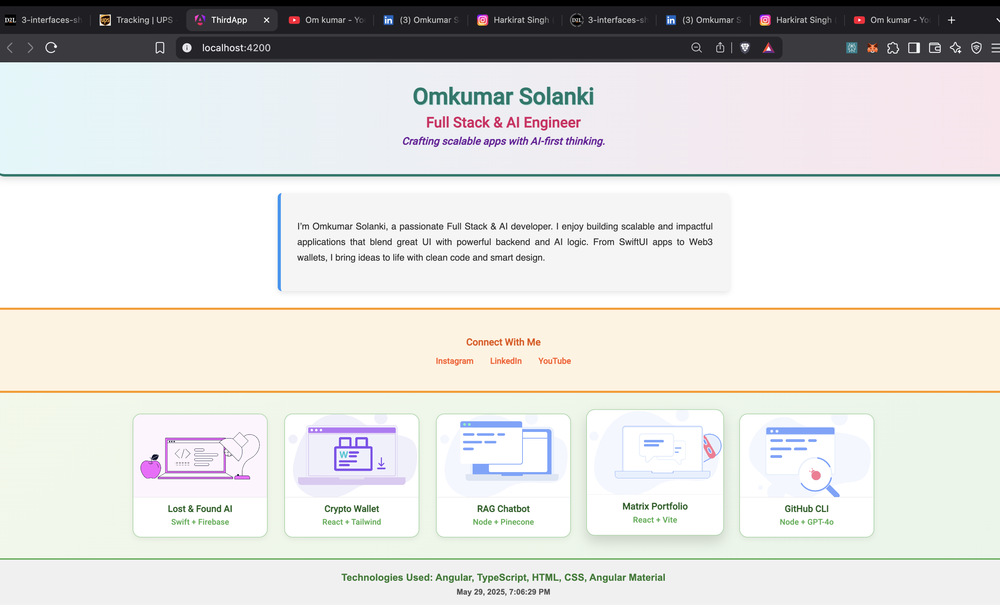

## Preview




# Angular Developer Portfolio App (Material UI)

This is a personal developer portfolio built using **Angular 16+** and **Angular Material**. The application showcases the use of Angular components, `@Input()` data sharing, string interpolation, custom styling, and modern UI design principles. The layout strictly avoids tabs, as required by the assignment.

---

## Features

- Component-based architecture with shared interfaces
- Material Design integration using `MatCardModule`
- Five interactive project cards with dynamic data
- Responsive layout using Flexbox and CSS enhancements
- Data binding with `@Input()` and interpolation
- Use of Angular pipes (`date`) for formatting
- Unique visual design for each section

---

## Component Overview

| Component   | Description                                                                 |
|-------------|------------------------------------------------------------------------------|
| `header`    | Displays developer name, role, and motto via bound `@Input()` interface     |
| `about`     | Descriptive paragraph about the developer with styled text                  |
| `projects`  | Contains 5 project cards built with Angular Material and `@Input()` values   |
| `contact`   | Social media links dynamically displayed using interface + `@Input()`       |
| `footer`    | Technology list and system date using Angular pipes                         |

---

## Technologies Used

- Angular 16+
- Angular CLI
- Angular Material (`MatCardModule`)
- TypeScript
- HTML5 + CSS3

---

## Folder Structure
<pre lang="markdown"><code>
```
src/
├── app/
│   ├── about/
│   ├── contact/
│   ├── footer/
│   ├── header/
│   ├── projects/
│   ├── interfaces/
│   └── app.component.ts
│       app.component.html
│       app.component.css
├── assets/
│   └── images/
├── styles.css
├── index.html
```
</code></pre>


## Setup Instructions

1. **Install Angular CLI (if not already installed)**

```bash
npm install -g @angular/cli
```

2. **Clone the repository and navigate into the project folder**

```bash
cd your-project-folder
```

3. **Install dependencies**

```bash
npm install
```

4. **Start the development server**

```bash
ng serve --open
```

---

## Deployment Ready

This project can be deployed on:

- GitHub Pages
- Firebase Hosting
- Netlify
- Vercel (with SSR if needed)

Make sure to run a production build with:

```bash
ng build --configuration production
```

---

## Rubric Compliance Checklist

| Requirement                                      | Status |
|--------------------------------------------------|--------|
| Angular application using Angular CLI            | ✅ Yes |
| Angular Material used (e.g., MatCardModule)      | ✅ Yes |
| Components created: header, about, projects, etc.| ✅ Yes |
| Projects displayed using 5 individual cards      | ✅ Yes |
| No tabs used in layout                           | ✅ Yes |
| Content driven by variables and interfaces       | ✅ Yes |
| Interpolation and pipes used (`{{ }}`, `date`)   | ✅ Yes |
| Data shared using `@Input()`                     | ✅ Yes |
| Unique CSS styling per section                   | ✅ Yes |

---

## Author

**Omkumar Solanki**  
Full Stack Developer | AI Engineer | iOS SwiftUI-Storyboard  

- LinkedIn: [https://www.linkedin.com/in/omkumar-solanki-atluxuarywxtchbusinessmandeveloper2/](https://www.linkedin.com/in/omkumar-solanki-atluxuarywxtchbusinessmandeveloper2/)
